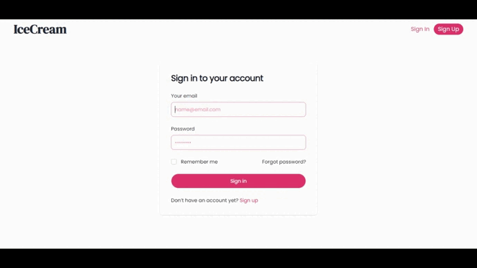

# Ice Cream Online Store Documentation

## Table of Contents

1. [Introduction](#introduction)
2. [Screen Recordings](#screen-recordings)
   - [Vendor Actions](#vendor-actions)
   - [Customer Interactions](#customer-interactions)
3. [Database Structure](#database-structure)
   - [Products Table](#products-table)
   - [Orders Table](#orders-table)
   - [Reviews Table](#reviews-table)
   - [Favorites Table](#favorites-table)
4. [Vendor Features](#vendor-features)
   - [Dashboard](#dashboard)
   - [Product Management](#product-management)
5. [Customer Features](#customer-features)
   - [Shopping](#shopping)
   - [Favorites and Reviews](#favorites-and-reviews)
6. [Project Setup](#project-setup)
   - [Laravel Backend](#laravel-backend)
   - [React Frontend](#react-frontend)

## Introduction

Welcome to the Ice Cream Online Store project, a delightful combination of Laravel, MySQL, React, and Tailwind CSS.

## Screen Recordings

### Vendor Actions



### Customer Interactions


## Database Structure

### Products Table

- ProductID (Primary Key)
- ProductName
- ProductPrice
- ProductDetails
- ProductStock
- ProductRating
- Image
- ProductSize
- user_id (Foreign Key referencing 'users' table)

### Orders Table

- OrderID (Primary Key)
- OrderQuantity
- TotalAmount
- user_id (Foreign Key referencing 'users' table)
- product_id (Foreign Key referencing 'products' table with cascade delete)

### Reviews Table

- ReviewID (Primary Key)
- Rating
- Comment
- user_id (Foreign Key referencing 'users' table)
- product_id (Foreign Key referencing 'products' table with cascade delete)

### Favorites Table

- FavoriteID (Primary Key)
- user_id (Foreign Key referencing 'users' table)
- product_id (Foreign Key referencing 'products' table with cascade delete)

## Vendor Features

### Dashboard

- View total products added
- View total quantity sold
- View total revenue
- View total likes

### Product Management

- Add new product
- Update existing product
- View all products
- View statistics for each product
- Perform actions (edit, delete) on products

## Customer Features

### Shopping

- Add products to the cart
- Select the quantity for each product
- View and manage the shopping cart

### Favorites and Reviews

- Like products
- Add reviews with star ratings and comments
- View and manage favorite products
- View and edit reviews

## Project Setup

### Laravel Backend

1. Clone the repository:

   ```bash
   git clone https://github.com/abdellah-agrm/ice-cream-store-react-laravel.git
   ```

2. Install dependencies:

   ```bash
   cd laravel_backend
   composer install
   ```

3. Set up your `.env` file and configure your MySQL database.

4. Migrate the database:

   ```bash
   php artisan migrate
   ```

5. Seed the database:

   ```bash
   php artisan db:seed
   ```

6. Start the Laravel development server:

   ```bash
   php artisan serve
   ```

### React Frontend

1. Navigate to the `react_frontend` directory:

   ```bash
   cd react_frontend
   ```

2. Install dependencies:

   ```bash
   npm install
   ```

3. Start the React development server:

   ```bash
   npm start
   ```
